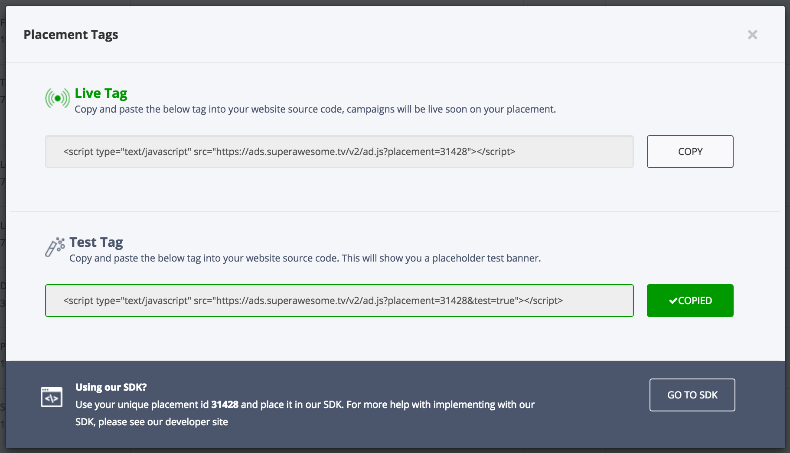
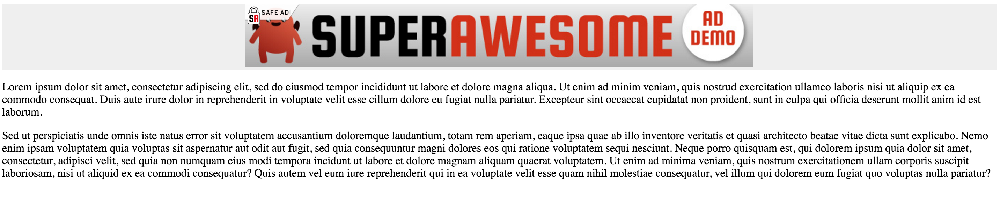

Display ads
===========

This section will present a list of ways to add a display ad (leaderboard, skinny skyscraper, MPU) to you webpage.

Placement tags
^^^^^^^^^^^^^^

The simplest way get a hold of the relevant display ad is to head over to your Dashboard, select the placement you want to add and click on the
button marked **Get Placement Tags**.

 .. image:: img/IMG_02_Display_1.png

Then click on either the **Live Tag** or **Test Tag** buttons to copy the tag.

 * Live tags should be added only when you have a live campaign running on your placements; otherwise nothing will display
 * Test tags will always show a SuperAwesome test image corresponding to the type of placement chosen

After that you can add the copied tag in any part of your web app:

.. code-block:: html

    

        
    

Notice the tag you copied from the dashboard is identical to the one presented in the **Integrate the SDK** chapter.
The dashboard is just a convenient way of obtaining the correct, right code for your app, without much hassle.

Javascript object
^^^^^^^^^^^^^^^^^

If you want to create the ad as a Javascript object, you'll need to first add the AwesomeAds SDK into your header (as presented in
the **Integrate the SDK** chapter), then:

.. code-block:: html

    <!-- define a div to display the ad in -->
    

    <!-- and once the page gets loaded -->
    

Result
^^^^^^

In both cases the result will be an ad showing on your page, similar to this:

