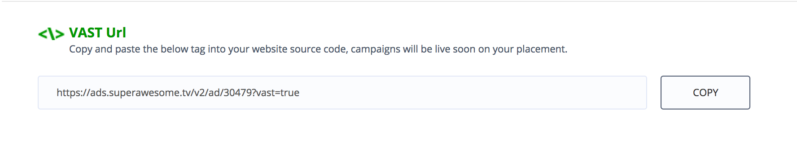
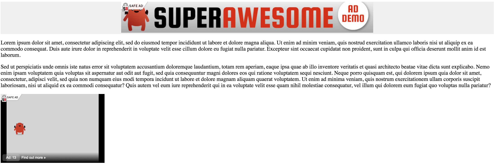

Video ads
=========

This section will present a list of ways to add a video ad to you webpage.

Placement tags
^^^^^^^^^^^^^^

Video ads can be embedded just as easily as display ads, by either going to the Dashboard and obtaining the Live or Test tag, or adding it manually, as follows:

.. code-block:: html

    

        
    

Notice that video ads **must** have the **video=true** parameter set, otherwise they won't display.

The result is something similar to this:

.. image:: img/IMG_03_Video_1.png

This however will add a video that will expand to fill it's natural size.

Wrapper tags
^^^^^^^^^^^^

If you want to force the video to fit a certain size (ex: a div of 300x200 px to display the video in), you're better
adding a script video wrapper instead:

.. code-block:: html

    

        <!-- content in the div will be masked by the video -->
    

    

Notice that the containing div and the script tag are separate.
Also note that the script tag contains some additional parameters:

 * data-test-enabled: can be true or false
 * data-post-ad-container: where the ad should be placed
 * data-has-small-click: whether the whole video surface is clickable, or just a "Find out more" button in the bottom-left part of the screen
 * data-is-skippable: whether video is skippable (only for videos > 30s)

Also note that the source parameter of the script tag must only contain the placement format.

Javascript object
^^^^^^^^^^^^^^^^^

If you want more control over your video ads you can add them as a Javascript object:

.. code-block:: html

    <!-- define a div to display the ad in -->
    

    <!-- and once the page gets loaded -->
    

The AwesomeVideo function has three parameters:

  * the Id of the placement to be loaded
  * if test is enabled or not
  * the DOM element to render the video to
  * whether the whole video surface is clickable or not

VAST tag
^^^^^^^^

Finally, if you want to plug our video sources into a 3rd party ad server of video player that supports `VAST <https://www.iab.com/guidelines/digital-video-ad-serving-template-vast-3-0/>`_,
you can use our VAST tag integration.

You can obtain it from the Dashboard, under the **Get Placements** button:

From there you can copy a VAST tag looking similar to this:

.. code-block:: html

    https://ads.superawesome.tv/v2/ad/30479?vast=true

While this will be OK in most cases, you can also add a number of additional parameters to it that'll help both our
reporting as well as the efficiency of campaigns:

=========  =================  ===========
Parameter  Values             Description
=========  =================  ===========
test       true / false       Enables or disables test ads
bundle     com.example.myapp  The iOS / Android Bundle identifier. Only for mobile.
device     phone / tablet     The type of device the request is made
ua         Mozilla/5.0...     Override User Agent (Useful for server-to-server integration)
ip         172.16.200.1       Override IP address (Useful for server-to-server integration)
ct         1 - 6              wifi = 2, 2G = 4, 3G = 5, 4G = 6
country    GB / CH / etc      Override country detected from IP Address
lang       fr_CH              User phone language settings
=========  =================  ===========

Thus, a more complete VAST tag would look something similar to this:

.. code-block:: html

    https://ads.superawesome.tv/v2/ad/30479
      ?vast=true
      &test=false
      &bundle=com.example.myapp
      &device=tablet
      &ua=Mozilla%2F5.0%20%28Linux%3B%20Android%204.0.4....Mobile%20Safari%2F535.19
      &ip=172.16.200.1
      &ct=2
      &country=GB
      &lang=en_GB

Ideally these parameters would be filled out at runtime by dynamic macros specific to each ad server.

Result
^^^^^^

In all cases the result will be something similar to this:

Notice in this case the video did indeed respect the containing div's 300x200px size.
