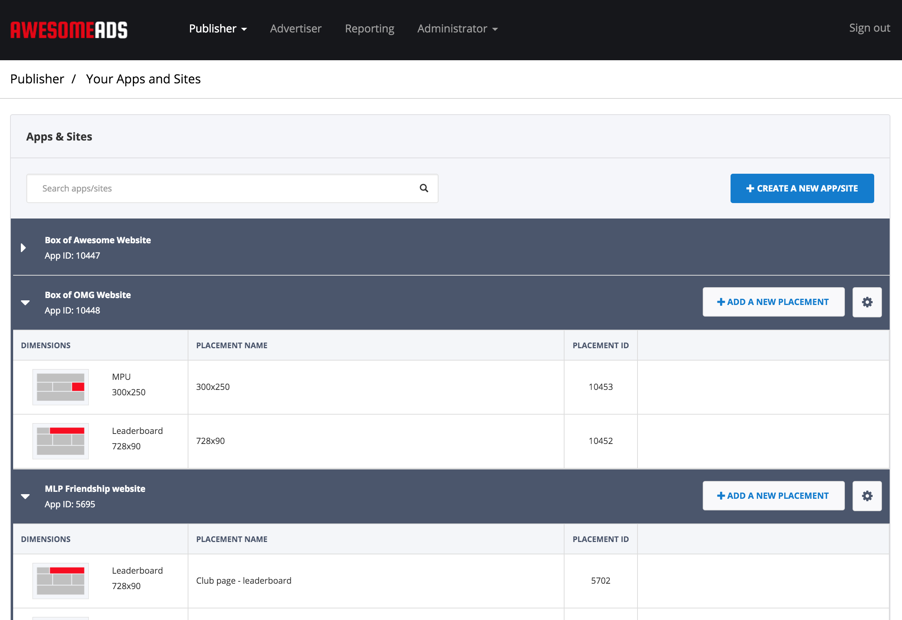
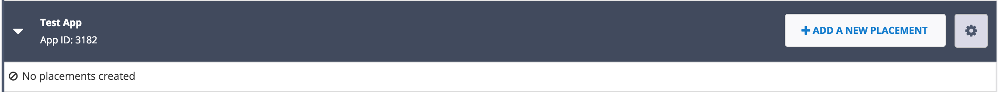
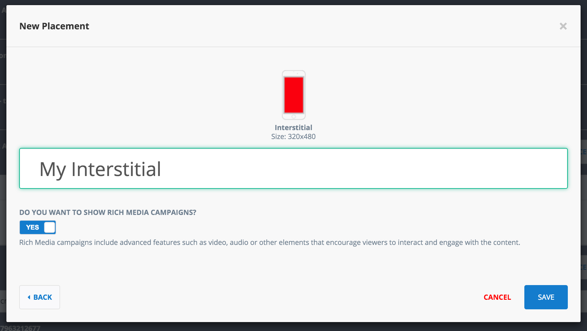
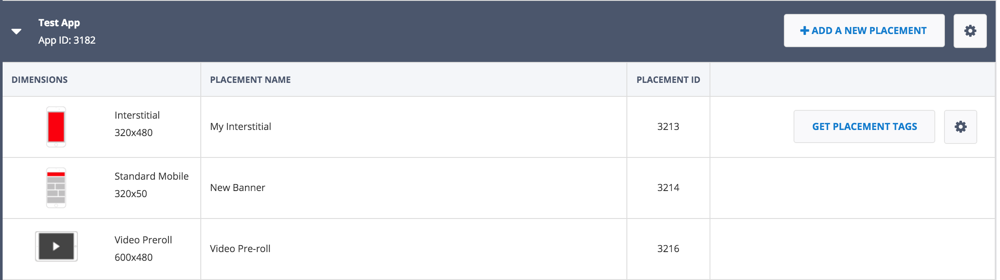

Initial setup
=============

The first step in integrating the SuperAwesome SDK is to register on the `SuperAwesome Dashboard <http://dashboard.superawesome.tv>`_.

From here you'll be able to create apps and placements, obtain performance reports (number of impressions, clicks), view current revenue, etc.

Create apps
^^^^^^^^^^^

When first logging in to the dashboard, the first thing you'll want to do is create one or more **Apps**,
with each app in the dashboard representing one of your own apps.

Each app has a number of associated parameters such as ID, name, domain (or iTunes URL), etc.
The name and domain can be configured when you create the app, while the ID is automatically assigned so as to be unique to each app.

In turn, each app can have multiple placements.

Add placements
^^^^^^^^^^^^^^

Placements represent ad units where creatives will be served. Creatives are the actual ad data that gets shown in your app,
like images, videos, interactive rich media content, etc.

Each placement has a number of associated parameters like ID, name, format, dimension.

    * The placement's ID is a unique identifier associated with it. In the SDK it will be used to load ad data.
    * The name is a human readable identifier. It's good practice to name your placements something easy to remember or suggestive.
    * The format can be video, display, etc, and informs you of what type of ads should be run on the placement.
    * The dimensions give you an idea of where you should try to place the ad in your app.

Below you can find a description of all mobile placement types, as well as test IDs, that have a 100% fill rate.

==================  ==========  =============================   ==============
Name                Size        Description                     Test Placement
==================  ==========  =============================   ==============
Small Leaderboard   468x60px    A small desktop leaderboard     31430
Leaderboard         728x90px    Desktop leaderboard             31428
Billboard           970x250px   A big billboard                 31436
MPU                 300x250px   A small MPU unit                31429
Double MPU          300x600px   A big MPU unit                  31432
Skinny Skyscraper   120x600px   A small skyscraper              31431
Skyscraper          160x600px   A big skyscraper                31435
Page Skin           1x1px       A variable size site skin       31433
Floor Ad            1x1px       A variable size floor ad        30789
Desktop Preroll     1x1         Desktop video                   30479
==================  ==========  =============================   ==============
