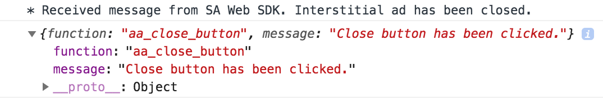

Interstitial ads
================

This section will present a list of ways to add an interstitial ad to you webpage.

Placement tags
^^^^^^^^^^^^^^

Interstitial ads cover the whole screen and usually display above all other HTML content - thus they are best suited for mobile web pages.

To add an interstitial ad and show it when the page first loads, add it as a placement tag anywhere in your code:

.. code-block:: html

    

Notice the **interstitial=true** parameter.

Close action
^^^^^^^^^^^^

AwesomeAds Web SDK creates a close button (close image in the corner of the screen) which removes advert and related elements from the document.

This action will also send a cross-domain post message to the top-most window that can be used to trigger custom code or close the main context.
In order to catch the message please implement a receiver on the Window object e.g.:

.. code-block:: html

    

Here is the console output in the Developer Tools in the Chrome browser:

Javascript object
^^^^^^^^^^^^^^^^^

If you want to add an interstitial as a Javascript object (and trigger it on the push of a button, for example):

.. code-block:: html

    

Where the AwesomeInterstitial parameters are:

 * the id of the placement
 * whether testing is enabled or not
